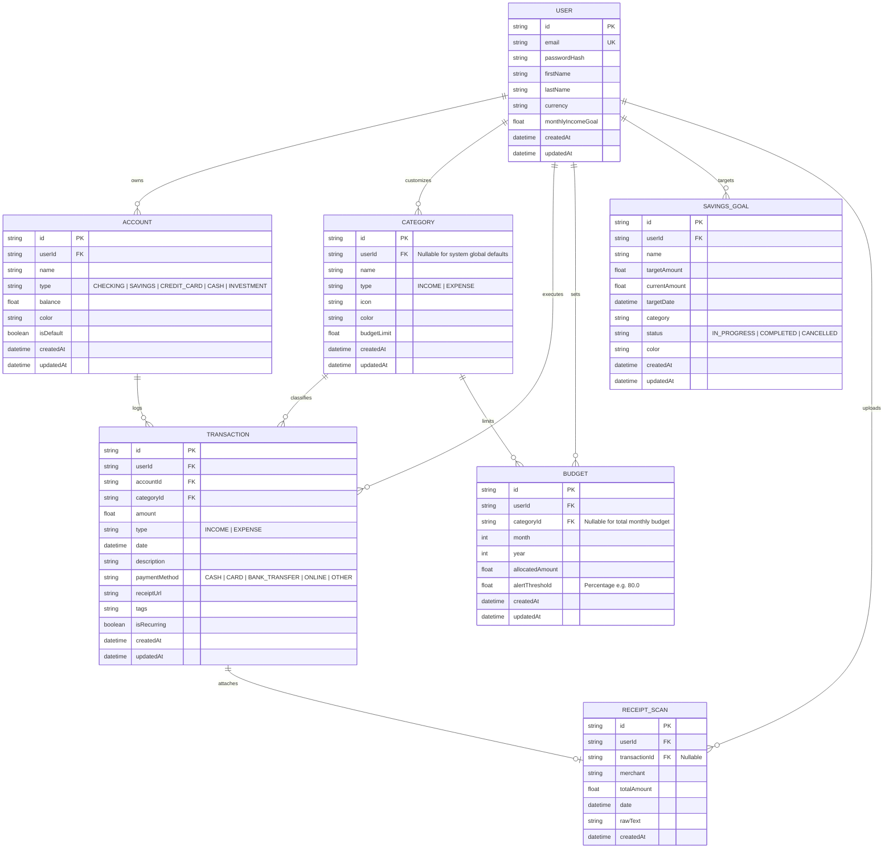

# SpendWise — Database Schema & Entity Relationship Diagram (ERD)

## 1. Entity Relationship Diagram

```mermaid
erDiagram
    USER ||--o{ ACCOUNT : owns
    USER ||--o{ CATEGORY : customizes
    USER ||--o{ TRANSACTION : executes
    USER ||--o{ BUDGET : sets
    USER ||--o{ SAVINGS_GOAL : targets
    USER ||--o{ RECEIPT_SCAN : uploads

    ACCOUNT ||--o{ TRANSACTION : logs
    CATEGORY ||--o{ TRANSACTION : classifies
    CATEGORY ||--o{ BUDGET : limits
    TRANSACTION ||--o| RECEIPT_SCAN : attaches

    USER {
        string id PK
        string email UK
        string passwordHash
        string firstName
        string lastName
        string currency
        float monthlyIncomeGoal
        datetime createdAt
        datetime updatedAt
    }

    ACCOUNT {
        string id PK
        string userId FK
        string name
        string type "CHECKING | SAVINGS | CREDIT_CARD | CASH | INVESTMENT"
        float balance
        string color
        boolean isDefault
        datetime createdAt
        datetime updatedAt
    }

    CATEGORY {
        string id PK
        string userId FK "Nullable for system global defaults"
        string name
        string type "INCOME | EXPENSE"
        string icon
        string color
        float budgetLimit
        datetime createdAt
        datetime updatedAt
    }

    TRANSACTION {
        string id PK
        string userId FK
        string accountId FK
        string categoryId FK
        float amount
        string type "INCOME | EXPENSE"
        datetime date
        string description
        string paymentMethod "CASH | CARD | BANK_TRANSFER | ONLINE | OTHER"
        string receiptUrl
        string tags
        boolean isRecurring
        datetime createdAt
        datetime updatedAt
    }

    BUDGET {
        string id PK
        string userId FK
        string categoryId FK "Nullable for total monthly budget"
        int month
        int year
        float allocatedAmount
        float alertThreshold "Percentage e.g. 80.0"
        datetime createdAt
        datetime updatedAt
    }

    SAVINGS_GOAL {
        string id PK
        string userId FK
        string name
        float targetAmount
        float currentAmount
        datetime targetDate
        string category
        string status "IN_PROGRESS | COMPLETED | CANCELLED"
        string color
        datetime createdAt
        datetime updatedAt
    }

    RECEIPT_SCAN {
        string id PK
        string userId FK
        string transactionId FK "Nullable"
        string merchant
        float totalAmount
        datetime date
        string rawText
        datetime createdAt
    }
```
